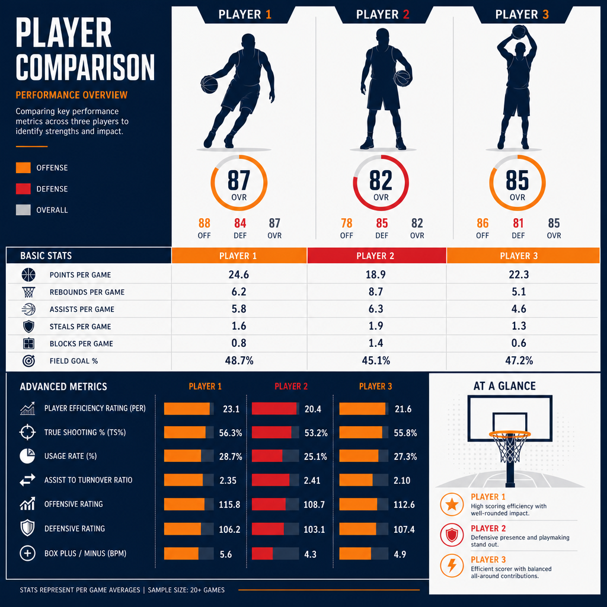

# עונת ה-MVP של ויקטור ומבניאמה — האם הגנה יכולה להכריע את הפרס?

יש עונות שבהן שחקן לא רק משתפר, אלא מכריח את כולם לשנות את ההגדרות. עונת 2025-26 של ויקטור ומבניאמה הייתה כזאת. שחקן שנה שלישית, בן 22, מסן אנטוניו ספרס — ובכל זאת אחד משלושת המועמדים הסופיים לפרס השחקן המצטיין של ה-NBA, לצד שאי גילג'ס-אלכסנדר וניקולה יוקיץ'. מה שהופך את הסיפור הזה למיוחד הוא לא רק הגיל. זה **סוג ההשפעה**: ומבניאמה הגיע לפסגת המרוץ בזכות מה שהוא עושה בצד ההגנתי של הפרקט — בפרס שכמעט תמיד שמור לכוכבי התקפה.

## שחקן שמשנה את מאזן הכוחות

הציפיות מהספרס לפני העונה היו צנועות. פרשנים רבים חזו להם מקום שמיני או תשיעי במערב — עונת מעבר של קבוצה צעירה שבונה סביב הכישרון היוצא דופן שלה. במקום זה, סן אנטוניו סיימה עם אחד המאזנים הטובים בליגה, במרחק נגיעה מאוקלהומה סיטי שהובילה את הטבלה.

ההבדל בין תחזית למציאות נשען כמעט כולו על אדם אחד. ומבניאמה, סנטר בגובה 2.24 מטר, הפך את ההגנה של הספרס לאחת המשוכללות ב-NBA. הוא לא סתם חוסם זריקות — הוא משנה את ההחלטות של היריב עוד לפני שהכדור עוזב את היד. שחקנים בוחרים לא לחדור, מוותרים על זריקות פתוחות, מחפשים מסלול אחר. ההשפעה הזאת קשה לתפוס בשורת סטטיסטיקה אחת, אבל היא ניכרת בכל דקה שהוא על הפרקט.

## מה אומרים המספרים

כאן מתחיל החלק המרתק — ומעט מבלבל. תלוי איפה מסתכלים, ומבניאמה הוא או המועמד המוביל, או הרחוק מכולם.

מודל אנליטי של Opta, שאומן על נתוני מרוצי MVP היסטוריים, פרסם באמצע מאי 2026 הערכת הסתברויות לזכייה:

- **שאי גילג'ס-אלכסנדר** (אוקלהומה סיטי): כ-45%
- **ניקולה יוקיץ'** (דנוור): כ-24%
- **ויקטור ומבניאמה** (סן אנטוניו): כ-9%

לפי המודל, גילג'ס-אלכסנדר מוביל בפער ניכר. הוא הביא את הת'אנדר למאזן המוביל בליגה עם ממוצע של קצת מעל 31 נקודות למשחק, סיים במקום גבוה במדדי התרומה לניצחונות, והוביל את הליגה ב-plus/minus. במילים אחרות: תפוקה, יעילות והצלחה קבוצתית שכולן מצביעות לאותו כיוון.

אבל בערוץ אחר לגמרי — ה-MVP ladder הרשמי של NBA.com — ומבניאמה דווקא **עקף** את גילג'ס-אלכסנדר, ה-MVP המכהן, ותפס את המקום הראשון. הפער בין שתי התמונות האלה הוא הסיפור האמיתי: מודל שמתוגמל על סטטיסטיקה התקפית קלאסית נותן לומבניאמה סיכוי נמוך, בעוד הדירוג שמשקלל נרטיב ותחושת רגע ממקם אותו בראש.

## הטיעון של ומבניאמה עצמו

עוד במרץ, בשיא העונה, ומבניאמה לא ניסה להתחמק מהשאלה. הוא אמר לתקשורת בפירוש שהגנה היא חצי מהמשחק, ושהיא מוערכת בחסר במרוץ ה-MVP. הטיעון שלו נשען על שלושה יסודות.

**ראשית, דומיננטיות הגנתית.** הוא הוביל את ה-NBA בחסימות עם ממוצע של יותר משלוש למשחק, והגנת הספרס נמנתה עם השלוש הטובות בליגה מבחינת יעילות. הוא נבחר למגן העונה — וכל הסימנים הצביעו על כך שיהיה הראשון בהיסטוריה שזוכה בתואר הזה פה אחד.

**שנית, השפעה דו-כיוונית.** מדד ה-swing שלו, שמודד את ההפרש בתפקוד הקבוצה כשהוא על הפרקט לעומת בלעדיו, עמד על כ-‎+17‎ נקודות ל-100 מהלכים. זה טווח שמזכיר את עונות השיא של לברון ג'יימס. כלומר, גם אם הסטטיסטיקה ההתקפית שלו לא זוהרת, הנוכחות שלו לבדה מזיזה את המחט.

**שלישית, ניצחונות.** הספרס לא רק שרדו — הם ניצחו. במפגשים מול אוקלהומה סיטי, הקבוצה הטובה בליגה, סן אנטוניו רשמה יתרון בולט. זה בדיוק סוג ההישג שמדבר אל הבוחרים: כשהכי חשוב, ומבניאמה הכריע גם מול הטובים ביותר.

## ומה אומרים בצד השני

מרוץ MVP אמיתי לא מוכרע בטיעון של צד אחד, ויש נגד ומבניאמה טענות ממשיות — לא זדוניות, פשוט עובדתיות.

**דקות המשחק.** ומבניאמה שיחק כ-29 דקות בממוצע. זה נשמע זניח, אבל אין לזה תקדים: מעולם לא זכה שחקן ב-MVP עם פחות משלושים דקות למשחק. השיא הנמוך הקודם שייך ליאניס אנטטוקומפו, וגם הוא היה מעל הסף הזה. פחות דקות פירושן פחות השפעה מצטברת לאורך המשחק — טיעון שקשה להתעלם ממנו.

**המספרים ההתקפיים.** כאן הפער בולט. ומבניאמה סיים במקום התשע-עשרה בלבד בנקודות למשחק, ובאזור נמוך במיוחד באסיסטים. יחס האסיסטים לאיבודי כדור שלו לאורך העונה כולה היה חיובי רק במעט. לזוכה MVP קלאסי, אלה נתונים חריגים כלפי מטה.

**יצירתיות מוגבלת.** הטענה שהשפעתו ההתקפית חורגת מעבר לקליעה נחלשת בדיוק בגלל מיעוט האסיסטים. הוא מאיים, הוא מושך תשומת לב הגנתית, אבל הוא עדיין לא זה שמנצח את ההתקפה ומכתיב לה קצב. כפי שניסח זאת המודל האנליטי: הוא משפיע כמעט על כל מהלך, אבל עוד לא מכתיב אותם.

## דאטה מול תפיסה

וזה בעצם לב העניין. מרוץ ה-MVP של 2025-26 הפך לזירה של שני עולמות. מצד אחד, המודלים המסורתיים, שנבנו על עשורים של זוכי MVP התקפיים, מתקשים לתמחר נכון שחקן שהערך שלו הגנתי. מצד שני, העין המקצועית והתחושה בזמן אמת — אותה תחושה שמיקמה את ומבניאמה בראש הדירוג הרשמי — מזהות שמשהו כאן חדש.

השאלה הגדולה היא לא רק מי ייקח את הפרס. השאלה היא האם ההגדרה של "השחקן המצטיין" מתחילה להשתנות. אם השפעה הגנתית מדידה כמו זו של ומבניאמה תוכל, בעונה כלשהי, להכריע מרוץ MVP — זה יסמן שינוי עמוק באופן שבו הליגה מודדת גדולה.

## אז מה בשורה התחתונה

נכון לעכשיו, ומבניאמה הוא אחד משלושת המועמדים הסופיים — לא יותר ולא פחות. אף מקור אינו מאשר מי זכה בפועל בפרס, וההסתברויות עדיין נטו לטובת גילג'ס-אלכסנדר. אבל עצם העובדה שסנטר הגנתי בן 22, בשנתו השלישית, נכנס לשיחה הזאת מכריחה אותנו לעצור.

אם זו רק ההתחלה שלו, קשה שלא לתהות איך תיראה השיחה הזאת בעוד שלוש שנים. ויקטור ומבניאמה כבר לא הבטחה של העתיד. הוא שינוי שקורה עכשיו — ואת מלוא המשמעות שלו נבין, כנראה, רק בדיעבד.
